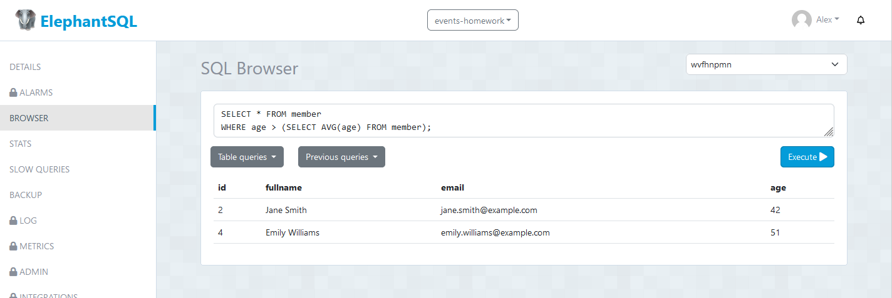

# Trabajo en clase

By: Calle Alex 
Date: 01-07-2024

## Realizar dos subconsultas aleatorias en la bd events

- ***Primera consulta: Mostrar todos los miembros que tengan una edad superior al promedio de edad de los miembros.***

**sentencia:**

SELECT * FROM member
WHERE age > (SELECT AVG(age) FROM member);

- ***Segunda consulta: Mostrar las conferencias que tuvieron una asistencia mayor al promedio***

**sentencia:**

SELECT title, speaker FROM conference c
WHERE c.total_attendees > (
SELECT AVG(total_attendees) FROM conference);

